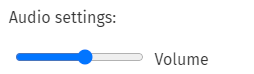

# 03 - CSS Variables

- CSS

  ```jsx
  // input type range
  <input type="range" id="volume" name="volume" min="0" max="11">
  ```

  

  ```java
  // input type color
  <input type="color" id="head" name="head" value="#e66465">
  ```

  

- JS

  ```jsx
  // thuộc tính dataset của một nodeElement chứa giá trị của những attr data- của element đó
  // ví dụ:
  // css
  <input type="color" id="head" name="head" value="#e66465" data-msg="changing color" data-default="yellow">
  // js
  const inputColor = document.getElementById("head");
  console.log(inputColor.dataset);
  // {msg: "changing color", default: "yellow"}
  ```

  ```jsx
  // set giá trị cho thuộc tính css của 1 element:
  <element>.style.setProperty('<tên thuộc tính>', '<giá trị>')

  // element :root
  document.documentElement
  ```
